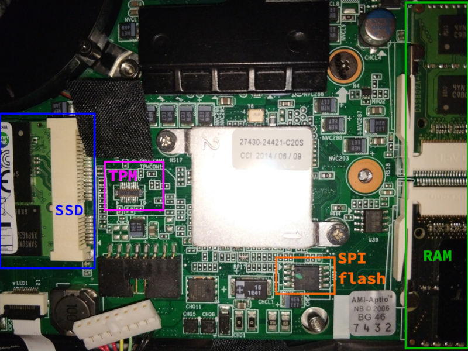

# Gigabyte P34G v2

This page describes how to run coreboot on the [Gigabyte P34G v2 gaming
laptop](https://www.gigabyte.com/Laptop/P34G-v2).

Original board name: GA-R3456R

Rebrands:
- Schenker XMG C404

## Technology

```eval_rst
+------------------+----------------------------------------------+
| Northbridge      | :doc:`../../northbridge/intel/haswell/index` |
+------------------+----------------------------------------------+
| Southbridge      | Lynx Point                                   |
+------------------+----------------------------------------------+
| CPU              | i7-4710HQ                                    |
+------------------+----------------------------------------------+
| EC / SuperIO     | ITE IT8587E                                  |
+------------------+----------------------------------------------+
| Coprocessor      | Intel ME, `me_cleaner` untested              |
+------------------+----------------------------------------------+
| TPM              | None, but socket exists (see photo below)    |
+------------------+----------------------------------------------+
```

## Required proprietary blobs

Please see [mrc.bin](../../northbridge/intel/haswell/mrc.bin).

## Flash chip

To access the SPI chip, turn the laptop upside down, loosen all the screws, and
remove the cover. The chip is located at the lower part of the mainboard between
the SSD and the RAM.



```eval_rst
+---------------------+------------+
| Type                | Value      |
+=====================+============+
| Socketed flash      | No         |
+---------------------+------------+
| Model               | MX25L6406E |
+---------------------+------------+
| Size                | 8 MiB      |
+---------------------+------------+
| In circuit flashing | Yes        |
+---------------------+------------+
| Package             | SOIC-8     |
+---------------------+------------+
| Write protection    | No         |
+---------------------+------------+
| Internal flashing   | Untested   |
+---------------------+------------+
```

## Flash layout

```text
00000000:00000fff fd
00400000:007fffff bios
00001000:003fffff me
```

## EC firmware

There is an additional 128KiB EC firmware blob within the BIOS region at
`0x700000`. The EC has its own internal EEPROM though, for which Gigabyte offers
updates in a bundle with the UEFI firmware updates based on AMI Aptio. The EC
firmware can be updated via [AMI Firmware Update (AFU)](
https://ami.com/en/products/firmware-tools-and-utilities/bios-uefi-utilities/).
An unmodified EC firmware version F005 seems to work fine with coreboot even
without the extra 128KiB part. It could be extracted from a firmware update
through `dd` etc and reinserted though. Other versions have not been tested.

## Known issues

- EC / ACPI
    * no suspend on lid close
    * eject, sleep, backlight up/down, external screen buttons do not work
    * Bluetooth LED shows inverted state, does not turn on on first press
    * battery state can not be queried
- CPU overheats on high load leading to immediate poweroff
- dedicated GPU is not available

Please also see the list of [known issues specific to Haswell](
../../northbridge/intel/haswell/known-issues).
